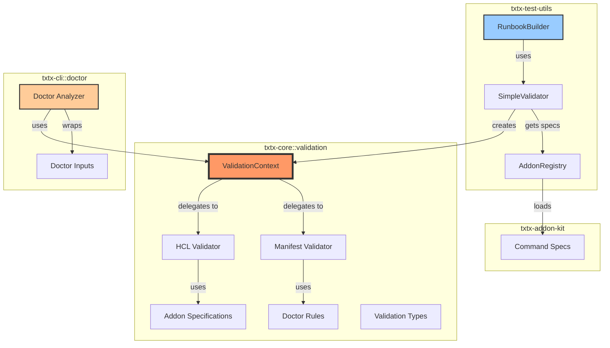
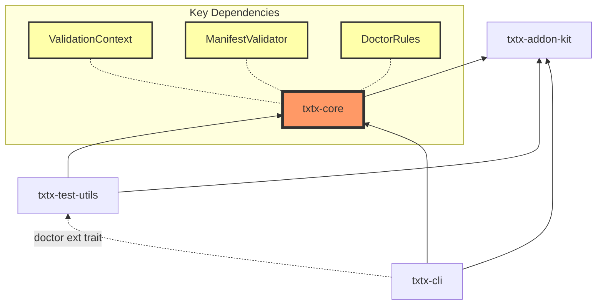
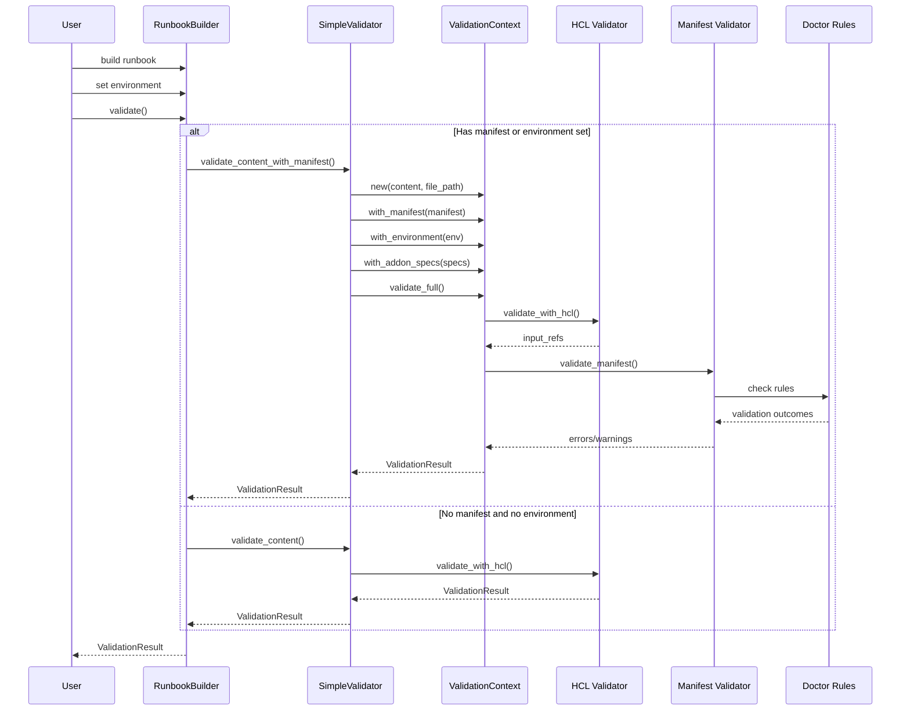
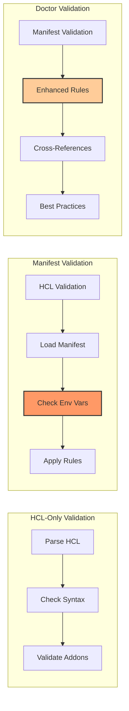

# Validation Architecture

This document describes the validation system architecture in txtx, including the recent refactoring that introduced `ValidationContext` and moved manifest validation from CLI to core.

## Overview

The txtx validation system provides multiple levels of validation:

1. **HCL Syntax Validation** - Validates the runbook syntax
2. **Semantic Validation** - Checks references, types, and addon specifications
3. **Manifest Validation** - Validates environment variables and inputs against a workspace manifest
4. **Doctor Validation** - Enhanced validation with additional rules and checks

## Component Diagram



## Dependency Diagram



## Validation Workflow



## Validation Modes Comparison



## Key Design Decisions

### 1. ValidationContext Introduction
The `ValidationContext` consolidates all validation parameters into a single object:
- Reduces parameter passing complexity
- Enables cleaner extension with new validation features
- Provides caching for computed values (e.g., effective inputs)

### 2. Manifest Validation Requirements
Manifest validation **requires** an environment to be specified:
- Without an environment, only "defaults" can be validated (partial scenario)
- This prevents false confidence from incomplete validation
- RunbookBuilder enforces this by requiring both manifest AND environment

### 3. Separation of Concerns
- **txtx-core**: Core validation logic (HCL, manifest, rules)
- **txtx-cli**: Doctor-specific analysis and enhanced validation
- **txtx-test-utils**: Test builder API and validation helpers

### 4. Extensible Rules System
The `ManifestValidationRule` trait allows:
- Core rules in txtx-core
- Doctor-specific rules in txtx-core (used by CLI)
- Custom rules for specific use cases

## ValidationContext API

```rust
// Create context with builder pattern
let mut context = ValidationContext::new(content, "test.tx")
    .with_manifest(manifest)
    .with_environment("production")
    .with_cli_inputs(vec![("key", "value")])
    .with_addon_specs(specs);

// Run full validation pipeline
context.validate_full(&mut result)?;

// Or run specific validation phases
context.validate_hcl(&mut result)?;
context.validate_manifest(config, &mut result);
```

## Rule Implementation Example

```rust
pub struct SensitiveDataRule;

impl ManifestValidationRule for SensitiveDataRule {
    fn check(&self, context: &ManifestValidationContext) -> ValidationOutcome {
        if context.input_name.contains("key") || 
           context.input_name.contains("secret") {
            if let Some(value) = context.effective_inputs.get(context.input_name) {
                if !value.starts_with("$") && !value.contains("vault") {
                    return ValidationOutcome::Warning {
                        message: format!("Sensitive data in '{}' may be exposed", context.input_name),
                        suggestion: Some("Consider using environment variables or a secrets manager".to_string()),
                    };
                }
            }
        }
        ValidationOutcome::Pass
    }
}
```

## Future Enhancements

1. **Async Validation** - Support for async validation rules
2. **Parallel Rule Execution** - Run independent rules concurrently
3. **Rule Priorities** - Allow rules to specify execution order
4. **Validation Caching** - Cache validation results for unchanged content
5. **Custom Rule Plugins** - Dynamic loading of validation rules
